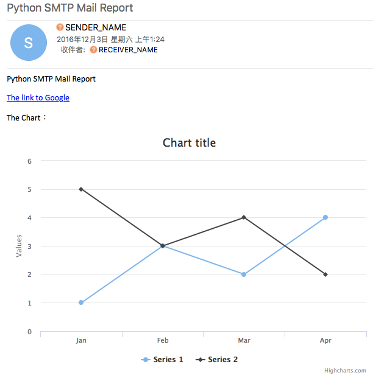

# The mail report generator
The file `highcharts-convert.js` is a [PhantomJS](http://phantomjs.org/) script to convert SVG or Highcharts JSON options objects to chart images. It is ideal for batch processing Highcharts configurations for attaching to emails or reports. It is also used in the featured (Java based) export server. An online demo with a GUI can be viewed at [export.highcharts.com/demo](http://export.highcharts.com/demo).

# Installation
You need to install PhantomJS, a headless browser based on WebKit.
For installation details, see http://phantomjs.org/download.html

# Example usage#
The following commands are tested under `phantomjs-2.1.1-macosx`:

## Command line
	phantomjs highcharts-convert.js -infile example1.json -outfile chart1.png -scale 2.5 -width 600
	phantomjs highcharts-convert.js -infile example2.json -outfile chart2.png -scale 2.5 -width 600
	python sendMailReport.py

## Screenshot

